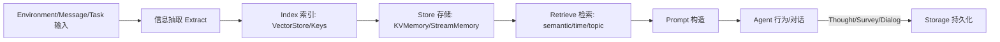
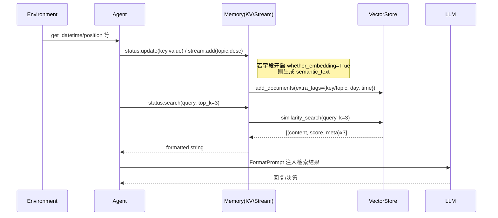

## 🧠 模拟社交平台中 Agent Memory 阅读与分析最终清单（结构化文本版）

### TL;DR（Workflow 一图看懂）

```mermaid
flowchart LR
  subgraph Generate
    G1[行为/对话/环境输入]
    G2[抽取关键信息\nBlocks/LLM]
    G3[写入 Memory\nstatus.update / stream.add]
  end
  subgraph Store & Index
    S1[KVMemory/StreamMemory]
    S2[VectorStore 索引\nembedding:init/update]
    S3[(DatabaseWriter\n对话/调查/状态/指标)]
  end
  subgraph Retrieve & Use
    R1[status.search / stream.search\n(top_k=3)]
    R2[FormatPrompt 注入]
    R3[LLM 生成\n计划/对话/动作]
  end
  G1-->G2-->G3-->S1-->S2
  G3-->S3
  S1-->R1-->R2-->R3
```

API 速查（最常用）：
- 写入：`status.update(key, value, mode=replace|merge)`；`stream.add(topic, description)`
- 检索：`status.search(query, top_k=3)`；`stream.search(query, topic?, top_k=3)`
- 注入：`FormatPrompt` 模板 `${status.*}/${context.*}` 自动取值并拼接到对话；
- 结果：LLM 输出用于生成“计划/对话/行动”，必要时再写回新记忆（闭环）。

---@agentsociety/

> 说明：本清单结合代码实现（`packages/agentsociety/agentsociety/memory/memory.py` 等），以中文为主、保留关键英文关键词（Memory / KVMemory / StreamMemory / VectorStore / Embedding / Prompt / Environment / Agent / LLM 等），并附带简单图示（diagram）。

### 目录
- 1️⃣ Memory 存储形式（Representation）
- 2️⃣ Memory 存储内容（Content）
- 3️⃣ Memory 生成、提取与存储流程（Lifecycle）
- 4️⃣ 新记忆生成与整合（New Memory Generation & Integration）
- 5️⃣ Memory 调用机制（Retrieval & Usage）
- 6️⃣ 系统架构与技术路径（Architecture & Implementation）
- 7️⃣ 反思与压缩机制（Reflection & Summarization）
- 8️⃣ 评估方法（Evaluation Metrics）
- 9️⃣ 进阶关注点与扩展议题（Advanced Considerations）

---

### 1️⃣ Memory 存储形式（Representation）

- **记忆类型（Memory Types）**：
  - ✓ 短期/状态记忆（`status` via `KVMemory`）
  - ✓ 事件流记忆（`stream` via `StreamMemory`）
  - ◻ 语义知识图（Graph）/层次树（Tree）（默认未实现，可扩展）

- **数据结构（Data Structures）**：
  - `KVMemory`：键值（key-value）存储 + 可选向量化索引（per-field embedding）
  - `StreamMemory`：时间序列 `MemoryNode(topic, day, t, location, description, cognition_id, id)`
  - `VectorStore`：统一语义检索接口（`similarity_search`/`add_documents`/`delete_documents`）

- **存储后端（Backends）**：
  - Memory 主体常驻进程内存；
  - 持久化侧：通过 `StorageDialog/StorageSurvey/StorageStatus/...` 写入数据库（`storage/database.py`，后端支持 sqlite/postgresql，参考设计文档）；
  - 向量化由 `fastembed.SparseTextEmbedding (Qdrant/bm25)` 驱动；

- **索引方式（Indexing）**：
  - 时间索引：`StreamMemory` 在 metadata 中记录 `day`、`time`；
  - 语义索引：`VectorStore` + Embedding；默认检索 `top_k = 3`（`KVMemory.search` 与 `StreamMemory.search` 的默认值）；
  - 关键词：可由上层给定 tag（如 `topic`）或字段名（KV 的 key）。

- **层级化记忆结构（Multi-level Memory Tree）**：
  - 默认未内置；可用「`status`（静态/慢变） + `stream`（动态事件） + `block_memory`（按 Block 定制的 KV）」组合实现近似分层；如需真正树结构，可在 `MemoryAttribute` 基础上扩展嵌套 schema。

---

### 2️⃣ Memory 存储内容（Content）

- **字段设计（Per-item fields）**：
  - `KVMemory`：由 `MemoryConfig/MemoryAttribute` 定义字段集合与是否向量化（`whether_embedding`、`embedding_template`）。
  - `StreamMemory`：`MemoryNode` 包含 `topic | day | t | location | description | cognition_id? | id`。

- **记忆类型划分（Kinds）**：
  - ✓ 事件记忆（`stream`）
  - ✓ 个人/档案/状态（`status`，如 `name/gender/age/education/occupation/...`）
  - ✓ 关系记忆（`social_network: list[SocialRelation]`）
  - ◻ 知识记忆（需要在 `MemoryAttribute` 中新增字段建模）
  - ◻ 自我记忆（个性/长期偏好已部分体现在 `status` 字段，如 `personality`）

- **情绪/社交标签（Emotion/Social Tags）**：
  - 默认未对单条 `stream` 记忆存情绪标签；可扩展为 `metadata` 或新增 `MemoryAttribute`。

- **摘要/压缩（Summarization）**：
  - 默认未内置自动摘要；支持通过 LLM/Block 在上层生成摘要并写回（见 7️⃣）。

- **元信息（Meta）**：
  - `stream` 的 meta：`topic/day/time/location/cognition_id`；
  - 重要度/置信度：默认无，可扩展为额外字段或 VectorStore tags。

---

### 3️⃣ Memory 生成、提取与存储流程（Lifecycle）





- **来源（Sources）**：
  - 行为/思考：`CitizenAgentBase.save_agent_thought()` → `stream.add(topic="cognition", description=...)`，并写入 `StorageDialog`；
  - 环境：`update_motion()` 将位置信息写入 `status`；
  - 对话/调查：访谈与调查结果写入数据库；必要时也可回写到 `status`（示例：`survey_responses`）。

- **抽取/解析（Extraction）**：
  - 可由 Block/LLM 在上层完成关键信息抽取，再通过 `status.update` / `stream.add` 写入。

- **检索（Retrieval）**：
  - `KVMemory.search(query, top_k)`：按字段向量检索，返回格式化文本；
  - `StreamMemory.search(query, topic?, top_k, day_range?, time_range?)`：语义 + 过滤；默认 `top_k=3`，返回按 `(day,time)` 降序排序；

- **存储策略（Strategy）**：
  - 即时写：`status.update`/`stream.add` 立即生效并更新向量；
  - 批量：上层可自行批量操作；
  - 遗忘/优先级：默认未实现（见 9️⃣）。

- **记忆巩固（Consolidation）**：
  - 默认无自动合并机制；可通过定时任务（Workflow FUNCTION）调用自定义合并/摘要逻辑。

---

### 4️⃣ 新记忆生成与整合（New Memory Generation & Integration）

- **触发方式（Triggers）**：
  - 事件触发：收到对话、完成行为、外部输入；
  - 周期触发：可通过 `WorkflowType.FUNCTION` 在引擎层实现定时反思写回；

- **整合方式（Integration）**：
  - `KVMemory.update(key, value, mode=replace|merge)`：支持集合/字典/列表的“增量合并”；
  - `StreamMemory.add(...)`：新增时间戳事件并在 VectorStore 写入 `{topic, day, time}` 标签；`add_cognition_to_memory(ids, cognition)` 可对已有事件附加“认知”链接；

- **重解释/重构（Reinterpretation）**：
  - 默认未自动实现；可通过上层策略对旧事件进行重写，再调用 `update` 覆盖/合并。

- **对个性/关系/决策的影响**：
  - 由 Agent 的 `forward()` 与 Blocks 决定；记忆搜索结果会注入 Prompt，影响 LLM 输出与后续行为。

---

### 5️⃣ Memory 调用机制（Retrieval & Usage）

- **调用时机（When）**：
  - 对话生成（interview/chat）、决策 `forward()`、Block 执行前后（`before_forward/after_forward`）。

- **调用方式（How）**：
  - 主动检索：`status.search(...)`、`stream.search(...)`；
  - 自动注入：通过 `FormatPrompt`（`agent/prompt.py`）在模板 `${status.*}/${profile.*}/${context.*}` 中异步取值并拼接。

- **检索策略（Strategy）**：
  - 语义相关性：VectorStore；
  - 时间衰减/情绪权重：默认未内置，可在上层先筛选/加权后再传入 `top_k/filter`；

- **Prompt 注入（Prompt Injection）与 Token 策略**：
  - `FormatPrompt` 负责拼接；Token 限制由上层 LLM 调用参数控制（如 `max_tokens`），未内置自动裁剪策略；
  - 上层可按优先级（重要度/新近性）自行裁剪。

#### I/O 速查表（API Inputs/Outputs）

- `KVMemory.get(key, default=None) -> Any`
  - 输入：`key` 字段名；
  - 输出：该字段值（深拷贝）。若不存在且无默认值则抛 `KeyError`。

- `KVMemory.update(key, value, mode="replace"|"merge") -> None`
  - 输入：字段名、值、更新模式；
  - 输出：无；若该字段 `whether_embedding=True`，则：
    - replace：删除旧 embedding -> 写入新 embedding；
    - merge：按集合/字典/列表等类型合并后重建 embedding。

- `KVMemory.search(query, top_k=3, filter=None) -> str`
  - 输入：检索文本、返回条数、过滤条件（如 `{key: "name"}`）；
  - 输出：格式化字符串，每行形如 `- My key is value`（源自 `embedding_template` 或默认模板）。

- `StreamMemory.add(topic, description) -> int`
  - 输入：`topic`、`description`；自动填充 `day/time/location`；
  - 输出：新事件的 `id`；并在 VectorStore 写入带 `{topic, day, time}` 的文档。

- `StreamMemory.search(query, topic=None, top_k=3, day_range=None, time_range=None) -> str`
  - 输入：检索文本、可选过滤；
  - 输出：格式化字符串，含 `topic/day/time/location`，时间降序。

- `StreamMemory.get_all() -> list[dict]`
  - 输出：所有事件的结构化字典（含 `id/cognition_id/topic/location/description/day/t`）。

---

### 6️⃣ 系统架构与技术路径（Architecture & Implementation）

```mermaid
flowchart TB
  subgraph Data Layer
    KV[KVMemory]:::mem
    STR[StreamMemory]:::mem
    VS[VectorStore]:::infra
    DB[(DatabaseWriter)]:::infra
  end
  subgraph Logic Layer
    MC[MemoryConfigGenerator]:::logic
    DP[BlockDispatcher]:::logic
    FP[FormatPrompt]:::logic
  end
  subgraph Behavior Layer
    AG[Agent (forward/run)]:::agent
    BL[Blocks]:::agent
    ENG[Engine (Simulation/Individual)]:::engine
  end
  ENV[Environment]:::env
  LLM[LLM]:::infra

  MC --> KV
  MC --> STR
  KV --> VS
  STR --> VS
  KV -.initialize_embeddings.-> VS
  KV -.update-> VS
  AG -->|status/stream| KV
  AG -->|status/stream| STR
  AG --> DP --> BL
  FP --> LLM
  ENG --> ENV
  AG --> FP
  ENG --> DB

  classDef mem fill:#f6ffed,stroke:#52c41a
  classDef logic fill:#e6f7ff,stroke:#1890ff
  classDef agent fill:#fff7e6,stroke:#fa8c16
  classDef infra fill:#f9f0ff,stroke:#722ed1
  classDef engine fill:#fff0f6,stroke:#eb2f96
  classDef env fill:#f0f5ff,stroke:#2f54eb
```

- **层次（Layers）**：数据层（Memory/VectorStore/DB）→ 逻辑层（Prompt/Dispatcher/Config）→ 行为层（Agent/Blocks/Engine）。
- **数据流（Dataflow）**：事件 → 存储（KV/Stream） → 检索（VectorStore） → Prompt → LLM → 行为/对话；
- **技术栈（Tech Stack）**：`fastembed.SparseTextEmbedding (Qdrant/bm25)`、向量检索 `VectorStore`、数据库写入 `DatabaseWriter`、LLM 多提供商并发（OpenAI/Qwen/DeepSeek/...）。
- **与 P-P-A（Perception/Planning/Action）交互**：
  - Perception：来自 Environment/Message 的状态与事件；
  - Planning：Blocks/LLM 参考 Memory 检索结果；
  - Action：`Agent.forward()` 执行后可写回新的记忆（如 thought）。
- **更新方式**：
  - 事件驱动（消息/环境变化）；
  - 周期反思（可用 Workflow FUNCTION 定时触发）。

---

### 7️⃣ 反思与压缩机制（Reflection & Summarization）

- **周期性反思（Reflection Loop）**：
  - 默认未内置循环；可在 `ExpConfig.workflow` 中通过 `FUNCTION` 步骤注入反思任务。

- **记忆融合/摘要（Summarization/Consolidation）**：
  - 默认未提供通用实现；示例流程：`stream.search_today(top_k=100)` -> LLM 摘要 -> `stream.add(topic="cognition", description=summary)` 或 `status.update("summary", summary)`；

- **一致性/冲突检查（Self-consistency Checking）**：
  - 默认无；可在自定义 Block 中比对 `status` 与 `stream`，发现冲突则修正/标注。

- **写回方式（Write-back）**：
  - 通过 `status.update` 或 `stream.add`；必要时同步到数据库（对话/摘要作为 `StorageDialog` / `StorageSurvey`）。

---

### 8️⃣ 评估方法（Evaluation Metrics）

- **整体效果（Effectiveness）**：
  - 一致性（consistency）、相关性（relevance）、行为连贯性（behavioral coherence）。

- **量化指标（Quantitative）**：
  - 记忆召回质量（recall quality）：基于标注集或任务表现；
  - 上下文相关性（context relevance score）：检索结果与当前任务相关性；

- **实验与记录（Experiment & Logs）**：
  - 引擎记录 LLM token 使用、环境指标（完成行程/里程等），但未内置专门的记忆评估模块；可在 `DatabaseWriter` 基础上扩展统计。

---

### 9️⃣ 进阶关注点与扩展议题（Advanced Considerations）

- **记忆衰减/遗忘（Decay/Forgetting）**：
  - 默认无；可在 `StreamMemory` 上基于 `day/time` 做时间窗过滤，或定期清理向量；

- **多 Agent 共享/集体记忆（Collective Memory）**：
  - 可通过 `Messager` 与 `Environment` 的 AOI 消息实现「外显共享信息」；未内置全局共享内存；

- **时间推理与演化（Temporal Reasoning）**：
  - 通过 `day/time` 与计划（Blocks/Environment Schedules）实现初步时间感知；

- **情绪与关系建模（Emotion/Relationship）**：
  - 关系：`social_network` 已内置；
  - 情绪：可扩展 `MemoryAttribute` 或给 `stream` 事件加标签；

- **记忆在行为生成中的作用（Behavior Grounding）**：
  - `FormatPrompt` 将检索结果注入到 LLM，对 `forward()` / 对话/调查生成起直接约束与支撑。

---

### 附：与代码的位置映射（Quick Map）

- Memory 核心：`agentsociety/memory/memory.py`
  - 默认检索参数：`KVMemory.search(top_k=3)`、`StreamMemory.search(top_k=3)`、`search_today(top_k=100)`；
- Memory 配置：`agentsociety/agent/memory_config_generator.py`
- Agent 框架：`agentsociety/agent/agent.py`、`agent_base.py`、`block.py`、`dispatcher.py`、`prompt.py`
- 检索后端：`agentsociety/vectorstore/vectorstore.py`、`fastembed`
- 引擎：`agentsociety/simulation/simulationengine.py`、`individualengine.py`
- 环境：`agentsociety/environment/environment.py`
- 消息：`agentsociety/message/messager.py`、`message_interceptor.py`
- 存储：`agentsociety/storage/*`（`type.py` 数据模型、`database.py` 写入）


